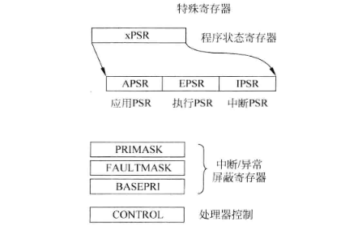

# 一.架构

## 1.操作模式与状态


M3/M4有两种状态：

* 调试状态：处理器会停止指令的执行；

* Thumb状态：可以执行指令；

M3/M4有两种模式：

* 处理模式：这种模式下往往处理异常，具备一定的特权访问

* 线程模式：一般来说，是正常执行普通代码的模式。拥不拥有特权等级都可以；

处理器在启动后，默认进入Thumb状态下的线程模式，具备一定的特权访问的权限，不过执行的是普通代码，对于很多简单的应用，非特权的线程模式不需要用到。如下图所示：


## 2.寄存器

cortexM3和M4处理器的寄存器中有16个寄存器，其中13个为32位的通用寄存器，其他三个用作特殊作用；


常用的名称如下：


**（1）.R0~R12**

这十三个寄存器为通用寄存器，前八个（R0~R7）被称为低寄存器。(R8~R12)称为高寄存器。

**（2）.R13**

栈指针常被用POP/PUSH去操作；有两个栈指针，一个为主栈指针（MSP）,一个是进程栈指针（PSP），由特殊寄存器的CONTROL决定。常在保存上下文的时候使用。

**（3）.R14**

链接寄存器，用于函数以及子程序调用时返回地址的保存。

**（4）.R15**

程序计数器，可读可写，读返回当前指令加4，写PC会导致跳转操作。


## 3.特殊寄存器

除了寄存器组中的寄存器之外，还有一些特殊的寄存器。常用于定义处理器状态，中断/异常屏蔽。



可以使用MSR和MRS等特殊寄存器访问指令来进行访问：

```c
MRS <reg> ,<special reg> ;将特殊寄存器读入寄存器
MSR <special reg>, <reg> ;写入特殊寄存器
```

区别特殊寄存器与其他例如IIC控制器里面的特殊功能寄存器。

### 3.1 程序状态寄存器


### 3.2 PRIMASK,FAULTMASK和BASEPRI寄存器

### 3.3 CONTROL寄存器

